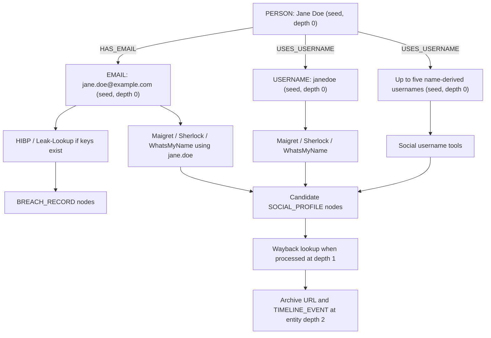

# Rahasya: Detailed Working Flow and Result Interpretation Report

**Codebase examined:** current workspace implementation  
**Report date:** 14 August 2026  
**Scope:** what the program actually executes, which external services it can contact, how data moves internally, and how to interpret every main result and metric.

> This is a code-grounded operational report. It distinguishes implemented runtime behavior from names or future claims in `FIXES.md` and `implementation_plan (1).md`.

## 1. Executive summary

Rahasya is an asynchronous OSINT orchestration and visualization application. A user gives it one or more identifiers—name, email, phone number, username, location, or a photo. The program converts those inputs into normalized **seed entities**, chooses compatible discovery modules, runs those modules, records new entities and relationships, and recursively uses sufficiently confident discoveries as inputs for the next layer.

The main runtime path is:

```mermaid
flowchart LR
    U["User input"] --> D["Streamlit dashboard or CLI"]
    D --> P["Create pending scan and scan ID"]
    P --> X{"Execution backend"}
    X -->|"Default"| T["Local background thread"]
    X -->|"Celery enabled"| C["Celery worker through Redis"]
    T --> O["Orchestrator"]
    C --> O
    O --> S["Generate seed entities"]
    S --> G["Graph and deduplication"]
    G --> M["Compatible discovery modules"]
    M --> W["External sites, APIs, CLIs, or local photo analysis"]
    W --> N["New entities"]
    N --> R["Relationships and entity resolution"]
    R --> Q{"Within depth, time, entity, and confidence rules?"}
    Q -->|"Yes"| M
    Q -->|"No or queue empty"| F["Final scan result"]
    O --> DS["Atomic JSON ScanStore snapshots"]
    F --> DS
    DS --> UI["CIA Web, Timeline, Exposure, and Export pages"]
```



By default, scan results are not stored in PostgreSQL. The operational dashboard path persists them as JSON under `data/scans/`. PostgreSQL, Neo4j, Redis, Celery, Tor, and Prometheus are optional infrastructure components.

## 2. The most important terms

| Term | Meaning in Rahasya |
|---|---|
| **Scan / investigation** | One complete run with a unique UUID, input request, status, entities, relationships, and statistics. |
| **Datapoint / identifier** | A raw fact supplied by the user or discovered by a module, such as an email or username. |
| **Entity** | The program's structured representation of a datapoint. Every entity has an ID, type, original value, normalized value, source module, confidence, discovery time, metadata, parent, and depth. |
| **Seed** | An entity created directly from the user's input before any external lookup. Seeds are the starting nodes of the search. |
| **Seed expansion** | Deriving additional starting identifiers from input. For example, a name generates username variants; an email generates its local part as a username. |
| **Normalized value** | A canonical form used for deduplication, such as lowercase email, E.164 phone, or lowercase/cleaned name. It is not necessarily the value displayed to the user. |
| **Module** | A plugin-like discovery component that declares which entity types it accepts and produces. |
| **Pivot** | Reusing a discovered entity as a new search input. Example: username → social profile → archive snapshots. |
| **Queue** | The list of entities waiting to be processed at the current recursion layer. The implementation uses breadth-first processing. |
| **Depth** | How far an entity is from the initial input. Seeds have entity depth `0`; direct discoveries normally have depth `1`; discoveries from them have depth `2`, and so on. |
| **Parent entity** | The entity whose module execution produced the new entity. It is stored as `parent_entity_id`. |
| **Relationship / edge** | A typed connection between two entity IDs, such as `HAS_EMAIL`, `HAS_PROFILE`, or `APPEARED_IN_BREACH`. |
| **Graph / CIA Web** | Entities represented as nodes and relationships represented as edges. |
| **Entity resolution** | Rules that decide whether two identifiers or profiles are the same, likely the same, or otherwise linked. |
| **Person cluster** | A dashboard-computed connected component of identity-style relationships. It is shown as `PC-001`, `PC-002`, etc. It is not currently saved as a first-class entity by the orchestrator. |
| **Confidence** | A module- or rule-assigned number from `0.0` to `1.0`. It controls recursive pivoting and UI filtering. It is a heuristic, not a statistically calibrated probability. |
| **Source reliability** | A separate label—`high`, `medium`, `low`, or `unverified`—describing the source's general quality. It is not used in the risk formula. |
| **ScanStore** | The durable JSON storage layer used by the dashboard and orchestrator. |
| **Status sidecar** | The small `<scan_id>.status.json` file containing live status, depth, current module list, and counts. |

## 3. Entry points and execution modes

### 3.1 Dashboard mode

The dashboard is launched with:

```powershell
python -m rahasya dashboard
```

The **New Scan** page accepts:

- full name;
- email;
- phone;
- username;
- location;
- age range;
- JPG, JPEG, or PNG photo;
- maximum recursion depth;
- maximum entity count;
- timeout in minutes;
- minimum confidence;
- social, breach, dark-web, and multimedia module category toggles.

Dashboard defaults are:

| Setting | Dashboard default | Allowed in UI |
|---|---:|---:|
| Maximum depth | 1 | 1–5 |
| Maximum entities | 300 | 50–5,000 |
| Timeout | 5 minutes | 1–120 minutes |
| Minimum confidence | 0.5 | 0.0–1.0 |
| Social modules | Enabled | On/off |
| Breach modules | Enabled | On/off |
| Dark-web modules | Disabled | On/off |
| Multimedia modules | Enabled | On/off |

The dashboard immediately creates and persists a `PENDING` scan, returns its ID, and dispatches work:

1. If `CELERY__ENABLED=true`, it sends `rahasya.tasks.scan_tasks.execute_scan` through Celery/Redis.
2. Otherwise, it submits the scan to an in-process `ThreadPoolExecutor` with four workers.
3. Streamlit returns control to the user and polls the ScanStore rather than holding the page open.

### 3.2 CLI scan mode

Example:

```powershell
python -m rahasya scan --name "Jane Doe" --email "jane@example.com" --max-depth 2
```

The CLI constructs the same `ScanRequest` and `Orchestrator`, but it waits in the terminal and polls the in-memory orchestrator once per second until completion. The dashboard category toggles do not apply to the CLI; all available compatible modules are considered.

### 3.3 Distributed/production-shaped mode

`docker compose up --build` defines:

- Streamlit web application;
- Celery worker;
- Flower task monitor;
- Redis broker/event service;
- PostgreSQL;
- Neo4j;
- Tor proxy;
- shared scan-data volume;
- worker Prometheus endpoint.

The shared scan volume is essential: the web process reads the same JSON files the Celery worker writes.

## 4. Step-by-step scan lifecycle

### Step 1: validate that at least one input exists

The dashboard refuses an entirely empty request. The CLI requires at least name, email, phone, username, or photo; location alone is accepted by the dashboard but not by the CLI guard.

### Step 2: allocate a scan ID and persist `PENDING`

The dashboard creates a UUID such as:

```text
f5fb38f9-30a2-4ad6-a3df-4ebd62b88092
```

It writes:

```text
data/scans/<scan_id>.json
data/scans/<scan_id>.status.json
```

The first file contains the complete result model. The sidecar contains lightweight progress fields.

### Step 3: convert input into seeds

The orchestrator creates these seeds:

| User input | Seed entities created |
|---|---|
| Name | One `PERSON` plus up to five username variants |
| Email | One `EMAIL` plus the email local part as a `USERNAME` when it has at least three characters |
| Phone | One normalized `PHONE` |
| Username | One `USERNAME` after removing a leading `@` |
| Photo | One `PHOTO` pointing to the saved local upload |
| Location | One `LOCATION` |

For `Jane Anne Doe`, candidate username variants are made from combinations such as:

```text
janeannedoe
jane_anne_doe
jane.anne.doe
janedoe
j_doe
doejane
```

The function uses a Python set and the orchestrator takes the first five, so the chosen ordering is not guaranteed across every process/runtime.

### Step 4: normalize seeds

- Names: accents removed, repeated whitespace collapsed, lowercased, and most punctuation removed.
- Emails: stripped and lowercased.
- Phones: parsed with `phonenumbers` and formatted as E.164; the default parsing region is `US` when no country prefix is supplied.
- Usernames: leading `@` removed and lowercase used as normalized form.
- Locations: stripped and lowercased.
- Photos: local path used as the normalized identity.

Deduplication uses this exact key:

```text
(entity_type, normalized_value)
```

Therefore the same normalized email is kept once per scan, but an email and username with identical text remain separate because their types differ.

### Step 5: register seeds in the graph and ScanStore

Each unique seed is:

1. added to scan state;
2. counted;
3. added to NetworkX or Neo4j;
4. written to the atomic JSON snapshot.

If a person seed exists, the orchestrator connects it to compatible seeds:

- person → email: `HAS_EMAIL`;
- person → phone: `HAS_PHONE`;
- person → username: `USES_USERNAME`;
- person → location: `LINKED_TO`;
- person → photo: `ASSOCIATED_WITH`.

If no name/person was supplied, independent email, phone, and username seeds are not automatically connected to a synthetic person.

### Step 6: choose compatible modules

`ModuleRegistry` walks the `rahasya.modules` package, imports module files, finds `BaseModule` subclasses, and caches one instance of each class.

For each entity, it selects modules whose `accepts` list contains that entity's type. The dashboard then applies category toggles.

Unavailable modules are omitted. Examples:

- HIBP is unavailable without a HIBP key.
- Intelligence X is unavailable without an IntelX key.
- Leak-Lookup is unavailable without its key.
- OnionSearch is unavailable unless Tor is enabled.
- Maigret and Sherlock require their CLI executables in `PATH`.

### Step 7: execute modules

For one entity, all compatible modules run concurrently with `asyncio.gather`. Entities within a breadth/depth layer are processed sequentially.

Every module call goes through `BaseModule.safe_execute`:

1. check availability;
2. initialize one reusable HTTP client;
3. wait `1 / rate_limit` seconds—normally one second;
4. execute the module;
5. catch ordinary exceptions and return an empty list;
6. log duration and result count.

The orchestrator additionally wraps each call in `asyncio.wait_for`. Default hard timeout is 30 seconds per module call, configurable with `SCAN__MODULE_TIMEOUT_SECONDS`.

### Step 8: receive and register discoveries

For every returned entity, the orchestrator:

1. sets entity depth to current processing depth + 1;
2. sets its parent to the entity that triggered the module;
3. deduplicates it;
4. adds it to the graph and durable result if new;
5. creates an inferred parent-child relationship;
6. enqueues it for another recursion layer only when confidence meets the threshold.

Important: a low-confidence entity can still appear in the final result and graph. The threshold prevents it from becoming a new pivot; it does not remove it.

### Step 9: infer a parent-child relationship

The direct inference map is:

| Parent type | Child type | Relationship |
|---|---|---|
| Person | Email | `HAS_EMAIL` |
| Person | Phone | `HAS_PHONE` |
| Person | Username | `USES_USERNAME` |
| Person | Location | `LINKED_TO` |
| Person | Photo | `ASSOCIATED_WITH` |
| Username | Social profile | `HAS_PROFILE` |
| Email | Breach record | `APPEARED_IN_BREACH` |
| Email, username, or phone | Dark-web mention | `MENTIONED_ON` |
| Photo | Location | `TAKEN_AT` |
| Any other combination | Any | `LINKED_TO` |

The relationship inherits the child entity's confidence.

### Step 10: run entity resolution

Resolution operates on the current entity's newly returned batch, not automatically on every entity from every historical scan.

Implemented rules are:

1. **Deterministic match:** exact normalized email, phone, or username → `SAME_AS`, confidence `1.0`.
2. **Fuzzy person name:** RapidFuzz token-sort ratio at least 85 → `SAME_AS` with score/100 confidence.
3. **Social-profile metadata:** profile metadata username matching a known username → `LINKED_TO` at `0.85`; matching email → `LINKED_TO` at `0.90`.
4. **Photo pHash:** Hamming distance ≤ 6 → `SAME_AS`; distance 7–12 → `LIKELY_SAME`.
5. **Masked recovery hint:** matching partial email/phone → `ALT_ACCOUNT_OF` at `0.92`; identical partial hints → `SHARES_RECOVERY` at `0.85`.

Relationships are deduplicated using an unordered `(entity A, entity B, relationship type)` key.

### Step 11: recurse breadth-first

The next queue becomes the current queue after all entities at the layer have been processed. Processing stops when any of these is true:

- queue becomes empty;
- time limit is reached;
- entity limit is reached;
- current processing depth exceeds maximum depth;
- the task is cancelled;
- an unhandled orchestration error occurs.

Depth nuance: the loop processes while `current_depth <= max_depth`. A module at the maximum processing depth can produce and persist a child whose entity depth is `max_depth + 1`; that child will not receive another module pass.

### Step 12: persist progress continuously

The orchestrator saves after seed/entity registration, meaningful batches, depth changes, and completion. Writes use a temporary file, `fsync`, and `os.replace`, so readers do not normally observe partially written JSON.

The status sidecar contains fields such as:

```json
{
  "scan_id": "...",
  "status": "RUNNING",
  "depth": 1,
  "module": "Maigret, Sherlock, WhatsMyName",
  "entity_count": 27,
  "relationship_count": 22,
  "modules_run": 8,
  "max_depth": 2,
  "max_entities": 300,
  "updated_at": "..."
}
```

### Step 13: complete and release resources

Final status becomes `COMPLETED`, `FAILED`, or `CANCELLED`. HTTP clients are closed, the final result is saved, a completion event is published, and Prometheus counters are updated when available.

## 5. Sites, APIs, and local tools actually used

The current runtime auto-registers **11 modules**.

### 5.1 Social/username modules

| Module | Inputs | What it contacts | Outputs | Availability |
|---|---|---|---|---|
| **Maigret** | Username, email, person | Runs the installed `maigret` CLI. Maigret itself contacts sites from the database bundled with the installed Maigret version. | Social profiles; email extracted from returned bio | Requires `maigret` executable |
| **Sherlock** | Username, email | Runs the installed `sherlock` CLI. Sherlock contacts sites from its installed site catalog. | Social profiles | Requires `sherlock` executable |
| **WhatsMyName** | Username, email | Downloads the current site catalog from `raw.githubusercontent.com/WebBreacher/WhatsMyName/main/wmn-data.json`, then contacts each catalog site's `uri_check`. | Social profiles | Always considered available; needs internet |

#### Maigret details

Command shape:

```text
maigret <target> --json <temporary-file> --no-color --timeout 10
```

- For email input, only the part before `@` is searched.
- Found sites become `SOCIAL_PROFILE` entities at confidence `0.85` and reliability `high`.
- Emails found in returned `about`/bio text become `EMAIL` entities at confidence `0.70`.
- The temporary JSON report is unique per run and deleted in `finally`.

#### Sherlock details

Command shape:

```text
sherlock <target> --print-all --output <temporary-file> --json <temporary-file>
```

- Email inputs are reduced to the local part.
- Returned profiles receive confidence `0.75`, reliability `medium`.

#### WhatsMyName details

- Its exact destination-site list is dynamic and is not hardcoded in Rahasya.
- Up to 30 site checks run concurrently.
- It uses each catalog entry's expected status code, positive string, and missing string.
- A positive result receives confidence `0.80`, reliability `medium`.
- The catalog is cached at `data/cache/whatsmyname_data.json`.

Because Maigret, Sherlock, and WhatsMyName use external catalogs, a truthful fixed list of all contacted social domains cannot be given from this repository alone. The exact list depends on the downloaded/bundled catalog at scan time.

### 5.2 Breach and leak modules

| Module | Endpoints | Inputs | Outputs | Required configuration |
|---|---|---|---|---|
| **Have I Been Pwned (HIBP)** | `https://haveibeenpwned.com/api/v3/breachedaccount/<email>` and `/pasteaccount/<email>` | Email | Breach records | `API_KEYS__HIBP` or key pool |
| **Leak-Lookup** | `https://leak-lookup.com/api/search` | Email | Breach records | `API_KEYS__LEAKLOOKUP` |
| **Intelligence X** | `https://2.intelx.io/intelligent/search` and `/intelligent/search/result?id=...` | Email, phone, domain | Leak records and dark-web mentions | `API_KEYS__INTELX` or key pool |

HIBP assigns:

- regular breach confidence `0.99`;
- paste result confidence `0.90`;
- high reliability;
- severity `High` for sensitive HIBP breaches, otherwise `Medium`.

Leak-Lookup assigns confidence `0.80`, medium reliability, and a fixed `Medium` severity.

Intelligence X:

- starts a search, then polls up to three times at two-second intervals;
- limits itself to 10 started searches per module instance/day counter;
- labels records whose bucket contains `darknet` as dark-web mentions at confidence `0.85`;
- stores other records as generic leak records at confidence `0.80`.

### 5.3 Dark-web modules

| Module | Contacted sites | Tor required? | Output |
|---|---|---:|---|
| **Ahmia** | `https://ahmia.fi/api/search/?q=...` | No | Up to 10 dark-web mention entities |
| **OnionSearch** | Tor check plus configured Ahmia Onion, Ahmia clearnet, Haystak, and Torch search URLs | Yes | Up to five parsed results per engine |

Configured search engines are in `data/config/onion_engines.json`:

- Ahmia onion service;
- Ahmia clearnet search;
- Haystak onion service;
- Torch onion service.

OnionSearch first calls:

```text
https://check.torproject.org/api/ip
```

through the SOCKS proxy. If it does not confirm `IsTor: true`, OnionSearch returns no results. Even the clearnet engine inside this module is therefore skipped when Tor is unavailable. The separate Ahmia module remains the no-Tor path.

Dark-web results are search-index matches, not proof that the target owns an account, committed an act, or was directly compromised.

### 5.4 Archive/timeline module

The Wayback module contacts:

```text
https://archive.org/wayback/available?url=<encoded-url>
https://web.archive.org/cdx/search/cdx?url=<encoded-url>&output=json&limit=20
```

It accepts URL, domain, and social-profile entities. It produces:

- archive URL entities;
- timeline events with type `first_snapshot`;
- timestamp, source URL, status code, and subject metadata.

Social profiles discovered at adequate confidence can therefore pivot into archive queries on the next depth layer.

### 5.5 Local photo modules

These do not upload the image to a third party.

| Module | Tooling | Result |
|---|---|---|
| **ExifData** | Pillow EXIF parser | EXIF metadata and GPS-derived location |
| **ImageHash** | Pillow, `imagehash`, OpenCV Haar cascade | pHash, dHash, wHash, and detected face count |

Hash meanings:

- **pHash:** perceptual frequency-based fingerprint; useful for visually similar images.
- **dHash:** difference hash based on neighboring pixel gradients.
- **wHash:** wavelet hash, another perceptual fingerprint.
- **Face count:** number of approximate frontal faces found by OpenCV's Haar cascade. It does not identify who the faces are.

Current photo caveat: a derived photo entity uses the same `(PHOTO, normalized file path)` key as its seed. Deduplication can reject the enriched derived photo, so hash/EXIF fields may not appear as a separate persisted node. A newly produced GPS location has a different type/value and can still be stored.

## 6. Networking behavior and safeguards

`StealthHTTPClient` is based on `httpx.AsyncClient` and provides:

- randomized browser user-agent;
- common browser accept/language headers;
- TLS certificate verification by default;
- configurable request timeout, default 30 seconds;
- configurable maximum retries, default 3;
- random 0.5–2.0 second delay before a request sequence;
- exponential retry backoff;
- no retry on ordinary 4xx responses except 429;
- optional proxy/Tor transport.

There is also a one-second default module-level delay before execution. These delays are additive.

The HTTP wrapper calls `raise_for_status`. Consequently, provider code branches that inspect 401 or 429 after `get()` may not execute because those statuses are raised by the wrapper first. They are normally caught by module error handling after retry policy runs.

User-provided query values are URL-encoded for HIBP, Ahmia, WhatsMyName, OnionSearch, and Wayback construction.

## 7. Entity types and what each result means

| Entity type | Interpretation |
|---|---|
| `person` | A named human target or candidate person identity. |
| `email` | A complete email address. |
| `phone` | A phone number, normally normalized to E.164 when valid. |
| `username` | A handle that can be searched across services. |
| `social_profile` | A candidate public profile URL returned by a username tool. It is not proof of ownership. |
| `url` | A generic or archived URL. |
| `photo` | A local image or derived image-intelligence result. |
| `ip_address` | Reserved type; no current registered module produces it. |
| `breach_record` | A provider says the queried identifier appears in a named breach/paste. |
| `leak_record` | A generic Intelligence X leak/search record. |
| `dark_web_mention` | A search result from Ahmia, an onion engine, or Intelligence X. It needs human review. |
| `location` | User-provided location text or GPS extracted from EXIF. |
| `domain` | Reserved/accepted pivot type; seed generation does not currently create it automatically from email. |
| `partial_email` | A masked recovery email pattern; supported by models/resolver but no current registered module produces it. |
| `partial_phone` | A masked recovery phone pattern; supported by models/resolver but no current registered module produces it. |
| `company` | Reserved model; no current registered module produces it. |
| `timeline_event` | A timestamped event, currently produced by the Wayback module. |

## 8. Relationship types and what each edge means

### Actively created in the normal current path

| Relationship | Meaning |
|---|---|
| `HAS_EMAIL` | Person seed was supplied with or linked to an email. |
| `HAS_PHONE` | Person seed was supplied with or linked to a phone. |
| `USES_USERNAME` | Person seed was supplied with or linked to a username. |
| `HAS_PROFILE` | Username module returned a candidate social profile. |
| `APPEARED_IN_BREACH` | Email lookup returned a breach record. |
| `MENTIONED_ON` | Email, username, or phone produced a dark-web result. |
| `ASSOCIATED_WITH` | Person seed and photo were supplied together. |
| `TAKEN_AT` | Photo analysis produced a location. |
| `LINKED_TO` | Generic fallback or metadata-based link. |
| `SAME_AS` | Resolver considers two entities exact/fuzzy/perceptually matching. |
| `LIKELY_SAME` | Photo hashes are similar but outside the strongest threshold. |

### Supported by models/resolver but normally absent without additional producers

- `SHARES_RECOVERY`
- `ALT_ACCOUNT_OF`

### Defined but not currently emitted by registered runtime modules

- `OWNS`
- `PARENT_OF`
- `SIBLING_OF`
- `SPOUSE_OF`
- `WORKS_WITH`
- `MENTIONS`
- `EMPLOYED_AT`
- `WORKS_AT`
- `KNOWS`

The presence of a relationship name in the enum does not mean the current scan engine has a live producer for it.

## 9. Scan statuses

| Status | Meaning |
|---|---|
| `PENDING` | Scan ID and initial file exist, but execution has not entered the orchestrator. |
| `RUNNING` | Seeds/module recursion are active. |
| `COMPLETED` | Processing ended normally, including ending because a configured limit was reached. |
| `FAILED` | An unhandled orchestration/background error occurred. `ScanResult.error` may contain the exception summary. |
| `CANCELLED` | The local task received cancellation or the stored state was marked cancelled. |

Celery cancellation caveat: the dashboard can directly cancel an orchestrator only when that orchestrator is in the same process. If a scan runs in a separate Celery worker, the current fallback can mark the shared result cancelled but does not reliably revoke the worker task; the worker may continue and later overwrite the snapshot.

## 10. Scan statistics and dashboard metrics

### 10.1 Core scan statistics

| Metric | Exact meaning |
|---|---|
| **Total entities** | Count of unique entities registered in this scan, including seeds and low-confidence discoveries. |
| **By type** | Total entity count grouped by `entity_type`. |
| **Total relationships** | Number of stored edge objects created by seed linking, parent-child inference, and resolution. |
| **Modules run** | Number of compatible module attempts whose gathered result was processed, including calls that timed out or returned no entities. It is not the number of websites contacted. |
| **Depth reached** | Number assigned after completing breadth layers. It describes processing progress, not always the maximum `entity.depth` exactly. |
| **Duration seconds** | Monotonic elapsed time from orchestrator initialization to the instant the result is requested/saved. |

### 10.2 New Scan progress bar

The displayed progress is:

```text
max(current_depth / max_depth, entity_count / max_entities)
```

The entity fraction is capped at `0.99` until terminal status. Terminal status forces 100%.

This is an activity indicator, not a prediction of how much web work remains. Module/site counts and response times are unknown in advance.

### 10.3 CIA Web metrics

| Metric | Meaning |
|---|---|
| **Investigation** | First eight characters of scan UUID. |
| **Visible nodes** | Entities remaining after entity type, entity confidence, and text-search filters, plus any nodes re-added to show a selected path. |
| **Visible edges** | Relationships whose endpoints are visible and whose type/confidence pass filters. |
| **Person clusters** | Count of connected identity-style components containing at least two nodes. |

Person cluster edges are restricted to:

```text
SAME_AS, LIKELY_SAME, ALT_ACCOUNT_OF, SHARES_RECOVERY,
HAS_EMAIL, HAS_PHONE, USES_USERNAME, HAS_PROFILE
```

and require relationship confidence at least `0.6`.

### 10.4 Path finder

The path finder converts the result to an undirected NetworkX graph and returns the unweighted shortest path by number of edges. It answers “what chain of relationships connects A and B?” It does not choose the most confident path and does not account for edge direction.

### 10.5 System Status panel

PostgreSQL, Redis, and Tor status are short TCP socket probes to their configured host/port. `Online` means a TCP connection opened; it does not prove authentication, schema readiness, Redis permissions, or valid Tor routing.

## 11. Exposure/risk score: exact formulas

The exposure score is an explanatory heuristic, **not** a probability that the target is compromised and not a legal/security verdict.

### 11.1 Identity Exposure, 0–100

```text
min(email_count × 8, 16)
+ min(phone_count × 10, 20)
+ min(location_count × 10, 20)
+ min(social_profile_count × 3, 18)
+ min((photo + partial_email + partial_phone) × 5, 15)
```

The sum is capped at 100.

### 11.2 Credential Leaks, 0–100

For each breach or leak entity:

| Severity | Base points |
|---|---:|
| Low | 8 |
| Medium or unknown | 18 |
| High | 30 |
| Critical | 40 |

An additional 5 points is added for each sensitive leaked field among:

```text
password, passwords, credit card, ssn, phone, address, dob
```

Sensitive-field additions are capped at 20 per breach. The category is capped at 100.

### 11.3 Dark Web Activity, 0–100

For `N` dark-web mentions:

```text
round(sum(18 / sqrt(rank) for rank = 1..N))
```

This diminishing formula reduces linear inflation from duplicates. The result is capped at 100.

### 11.4 Platform Footprint, 0–100

```text
unique_platform_count × 5
+ min(social_profile_count × 2, 30)
```

Capped at 100.

### 11.5 Relationship Exposure, 0–100

Each qualifying relationship contributes `weight × relationship confidence`:

| Relationship | Weight |
|---|---:|
| `SHARES_RECOVERY` | 20 |
| `ALT_ACCOUNT_OF` | 16 |
| `PARENT_OF` | 12 |
| `SIBLING_OF` | 10 |
| `SPOUSE_OF` | 10 |
| `WORKS_WITH` | 8 |
| `EMPLOYED_AT` | 8 |

The sum is rounded and capped at 100. In the current runtime this category will commonly be zero because most of these edge producers are not implemented.

### 11.6 Overall score

```text
Identity Exposure      × 0.20
+ Credential Leaks     × 0.30
+ Dark Web Activity    × 0.25
+ Platform Footprint   × 0.10
+ Relationship Exposure × 0.15
```

The result is rounded to an integer. The five highest non-zero categories become the “Why this score is high” rationales.

### 11.7 Recommendation generation

- Credential score > 0: rotate passwords on up to five named breached services and enable phishing-resistant MFA.
- Dark-web score > 0: review sources and monitor identifiers.
- Platform footprint ≥ 20: audit up to five named platforms and remove dormant profiles.
- Relationship score > 0: remove public recovery/family/employer clues.
- Identity score ≥ 20: separate public contact aliases from sensitive accounts.
- No triggers: maintain unique passwords, MFA, and periodic monitoring.

## 12. Timeline behavior

For every entity, the dashboard tries dates in this order:

1. explicit `TimelineEvent.occurred_at` or matching metadata;
2. breach date;
3. social-profile creation date;
4. otherwise the entity's Rahasya discovery timestamp.

The Gantt renderer gives each point a 12-hour visual bar so it can be hovered and seen. The 12-hour length is presentation-only; it does not mean the event lasted 12 hours.

Thus many timeline rows currently mean “Rahasya discovered this at this time,” not “this identity first appeared on the internet at this time.” Wayback timestamps are closer to historical first-seen evidence, subject to the 20-result CDX limit and archive coverage.

## 13. CIA Web behavior

The graph uses PyVis/vis-network with three layouts:

- **Force-Directed:** Barnes-Hut physics for a general relationship map.
- **Hierarchical (by depth):** left-to-right layout using entity depth.
- **Cluster-focused:** ForceAtlas2-style settings to pull connected groups together.

Node colors correspond to entity type. A thick colored border indicates membership in a computed person cluster. Clicking a node opens an in-graph evidence panel containing:

- value;
- type;
- source module;
- confidence;
- cluster ID;
- visible linked evidence;
- raw metadata.

Filters change only the view. They do not delete entities from the persisted scan.

## 14. Persistence and infrastructure responsibilities

| Component | Current responsibility |
|---|---|
| **ScanStore JSON** | Primary durable scan/result/status source for dashboard and main orchestrator path. |
| **NetworkX** | Default in-memory graph for one orchestrator instance. |
| **Neo4j** | Optional graph backend when explicitly enabled. Relationship types are enum-whitelisted before Cypher interpolation. |
| **PostgreSQL** | Schema/repositories and legacy task path exist, but the dashboard's main orchestrator result does not write entities to PostgreSQL. |
| **Redis** | Optional Celery broker/result backend and optional `rahasya.events` pub/sub channel. |
| **Celery** | Optional cross-process execution of the same disk-persisted scan worker. |
| **EventBus** | In-process callbacks plus optional Redis publication for scan events. The Streamlit pages currently poll ScanStore; they do not directly subscribe to Redis pub/sub. |
| **Tor** | SOCKS routing and circuit health/renewal for OnionSearch. |
| **Prometheus** | `rahasya_scans_started_total`, `rahasya_scans_completed_total{status}`, and `rahasya_active_scans`. |
| **Alembic** | Versioned PostgreSQL schema migration. |

The event enum contains entity/module lifecycle event types, but the orchestrator currently publishes scan started, progress, and completed events—not every declared event type.

## 15. Export outputs

| Export | Contains |
|---|---|
| **HTML** | Scan ID, status, entity/relationship totals, risk score, and entity table. |
| **CSV** | Entity value, type, discovery time, source, confidence, and depth. Relationships are not included. |
| **JSON** | Full scan request/result, entities, relationships, statistics, metadata, and timestamps. This is the most complete export. |

## 16. What is implemented versus what planning files claim

The actual runtime registry currently contains these 11 modules:

```text
Ahmia
WaybackMachine
ExifData
HIBP
ImageHash
IntelligenceX
LeakLookup
Maigret
OnionSearch
Sherlock
WhatsMyName
```

The current module tree does **not** contain live implementations for many names marked complete in `FIXES.md`, including examples such as:

- Google, Twitter, Instagram, and PayPal recovery enumeration;
- RecoveryMatcher as a registered module;
- SocialGraphScraper;
- PeopleSearch, Pipedream, TrueCaller, FamilySearch/Geni modules;
- Blackbird, Holehe, Socialscan, Toutatis, GHunt, Emailrep;
- Dread, Hunchly, BreachDirectory, HudsonRock, LeakPeek, Snusbase;
- GitHub/account-age/email-age modules;
- Yandex/Bing/PimEyes reverse-image adapters;
- Numverify, Twilio Lookup, Hunter, and HIBP Passwords modules.

Their corresponding model or relationship names may exist, but they are not contacted or executed by `ModuleRegistry` in this codebase. This distinction explains why family, employer, recovery, and alt-account metrics can remain empty even though the UI supports displaying those relationship types.

## 17. Known interpretation and implementation limitations

1. **Results are leads, not identity proof.** Username matches commonly produce false positives, especially for short/common handles.
2. **Confidence is hardcoded heuristic evidence.** For example, Maigret results are assigned `0.85`; the number is not learned from validation data.
3. **Source reliability is not incorporated into overall risk.** A medium-reliability and high-reliability entity can contribute equally by count.
4. **No cross-scan resolver runs automatically.** ScanStore keeps historical scans, but entities across different JSON scans are not merged into one global graph.
5. **Person clusters are view-time connected components.** They are not stable persisted identities and their `PC-###` numbering can change with filters/data order.
6. **Name fuzzy matching is permissive.** The current resolver can create `SAME_AS` from name similarity alone; it does not enforce two corroborating biographical signals.
7. **A batch can overshoot the entity limit.** The limit is checked around queue processing, not before every returned entity in a module batch.
8. **Photo enrichment can be deduplicated away.** Derived photo entities reuse the seed's normalized path.
9. **Progress is approximate.** It does not count the total number of third-party site checks.
10. **Timeline fallback is discovery time.** It should not be read as historical account creation unless a source supplied a historical timestamp.
11. **Default phone region is US.** An unqualified Indian or other international number can normalize incorrectly; supplying `+<country code>` is safer.
12. **Tor engine addresses and page layouts can change.** OnionSearch parsers are simple CSS selectors and can silently yield no results after site changes.
13. **External APIs need keys and quotas.** A green module category toggle does not guarantee the provider module is available.
14. **HTTP 4xx handling happens centrally.** Provider-specific 401/429 branches may be bypassed by `raise_for_status`.
15. **Celery cancellation is incomplete across processes.** Marking the JSON cancelled does not guarantee worker revocation.
16. **PostgreSQL is not the primary scan store yet.** Docker availability does not imply the main result is written to SQL tables.
17. **Redis pub/sub is published but not directly consumed by Streamlit.** The UI relies on JSON polling.

## 18. Worked example

Suppose the user submits:

```text
Name: Jane Doe
Email: jane.doe@example.com
Username: janedoe
Max depth: 1
Confidence threshold: 0.5
Social: on
Breach: on
Dark web: off
Multimedia: on
```

Likely flow:



With maximum processing depth 1, seeds are processed at layer 0 and sufficiently confident social profiles can be processed at layer 1. Wayback results created from layer 1 are persisted at entity depth 2 but are not processed again.

If the CIA Web shows:

```text
Entities: 35
Relationships: 29
Person clusters: 2
Risk score: 38
```

the correct interpretation is:

- 35 unique `(type, normalized value)` entities were stored, including seeds;
- 29 typed edge objects were stored;
- two multi-node identity-style connected components exist at relationship confidence ≥ 0.6;
- 38 is the weighted exposure heuristic described above, not a 38% chance of compromise;
- every candidate profile, archive result, breach, and dark-web result still requires source review.

## 19. Operational checklist for trustworthy use

Before a scan:

1. Use full international phone format, such as `+91...`.
2. Configure only provider keys you are authorized to use.
3. Confirm whether Tor and dark-web scanning are legally appropriate in the operating jurisdiction.
4. Use a low depth for broad/common names to control false positives and traffic.
5. Keep confidence threshold at or above 0.5 unless deliberately investigating weak leads.

After a scan:

1. Inspect source module and metadata for every important node.
2. Validate candidate profiles manually using multiple public signals.
3. Treat `SAME_AS`, cluster membership, and shortest paths as hypotheses.
4. Open source URLs and confirm timestamp/context.
5. Use JSON export for forensic completeness.
6. Record false positives instead of treating count/risk metrics as facts.
7. Do not use results for credential access, harassment, discrimination, or unauthorized private-data collection.

## 20. Primary code references

- Orchestration: `rahasya/core/orchestrator.py`
- Models and result vocabulary: `rahasya/core/models.py`
- Module discovery: `rahasya/modules/__init__.py`
- Module lifecycle: `rahasya/modules/base.py`
- Resolution: `rahasya/correlation/entity_resolver.py`
- Graph backend: `rahasya/correlation/graph_manager.py`
- Durable storage: `rahasya/storage/scan_store.py`
- Dashboard execution and metrics: `rahasya/dashboard/state.py`
- New Scan page: `rahasya/dashboard/pages/01_New_Scan.py`
- CIA Web page: `rahasya/dashboard/pages/02_CIA_Web.py`
- Timeline page: `rahasya/dashboard/pages/03_Timeline.py`
- Exposure page: `rahasya/dashboard/pages/04_Exposure_Report.py`
- Export page: `rahasya/dashboard/pages/05_Export.py`
- HTTP behavior: `rahasya/utils/http_client.py`
- Current onion engines: `data/config/onion_engines.json`
- Infrastructure: `docker-compose.yml`, `rahasya/celery_app.py`, and `rahasya/storage/migrations/`

## 21. Network, source, and error audit log

Every newly started scan now has an append-only audit file beside its scan result:

```text
data/scans/<scan-id>.network.jsonl
```

The **Network & Source Log** dashboard page reads this file while a scan is running, so it can be used as a live operational log. It shows:

- every HTTP attempt made through the shared client, including each retry;
- method, redacted URL, hostname, status code, duration, retry number, and proxy use;
- Tor exit verification and `.onion` health checks;
- each configured OnionSearch engine request and disabled-engine skip;
- URLs that loaded successfully but later failed during HTML parsing;
- every Maigret and Sherlock provider process, return code, and per-site result exposed by their JSON reports;
- module start, completion, no-result, skip, cancellation, timeout, and exception events;
- scan/depth lifecycle events and limits that stopped further traversal.

The page contains six complementary views:

1. **Chronological event log** — the exact event sequence, newest first.
2. **Sites, portals, and web links checked** — grouped source/link totals and last outcome.
3. **Host summary** — HTTP attempts, successes, failures, average latency, and last status.
4. **Source/module summary** — activity totals by Rahasya module.
5. **Errors, timeouts, and rate limits** — failure-only diagnostic log.
6. **Download report** — complete HTML, CSV, or JSON audit output.

Runtime event meanings:

| Event/outcome | Meaning |
|---|---|
| `network_request / success` | The remote server returned a status below 400. It does not prove the search found the person. |
| `network_request / http_error` | The server responded with HTTP 4xx or 5xx. The status code identifies the class of failure. |
| `network_request / rate_limited` | HTTP 429 was returned; retries may follow. |
| `network_request / failed` | No usable HTTP response was received, such as DNS, connect, TLS, proxy, or timeout failure. |
| `provider_site_check / success` | Maigret or Sherlock reported a claimed/found account for that site. |
| `provider_site_check / not_found` | The provider checked the site but did not report an account. This is not a network error. |
| `source_parse_failed` | A page was fetched, but its returned structure could not be parsed as expected. |
| `module_skipped` | A compatible module was considered but a key, CLI, Tor setting, or other prerequisite was unavailable. |
| `module_completed / no_results` | The module ran without an exception but produced no entities. |
| `module_timeout` | The orchestrator's per-module deadline was exceeded. |

Configured first-party destinations currently visible in code/config include HIBP, Intelligence X, Leak-Lookup, Ahmia, the Internet Archive/Wayback Machine, Tor Project exit verification, the DuckDuckGo onion health endpoint, the WhatsMyName catalog on GitHub, and the configured Ahmia/Haystak/Torch search endpoints. WhatsMyName then checks the catalog-provided public sites through the shared HTTP client. Maigret and Sherlock perform their own checks inside external CLI processes; their provider reports are converted into per-site audit events because their internal sockets are not directly visible to Rahasya.

Security and retention behavior:

- password/userinfo and common secret query values (`api_key`, `token`, `password`, and related names) are replaced with `REDACTED`;
- request bodies and request headers are not written to the audit log;
- URLs embedded in captured error messages are redacted too;
- deleting a saved scan deletes its JSON result, status sidecar, and network audit file together;
- old scans created before this feature cannot reconstruct historical traffic and correctly show an empty audit notice.

Code references:

- audit persistence/redaction/reports: `rahasya/storage/network_audit.py`
- HTTP request instrumentation: `rahasya/utils/http_client.py`
- module and scan lifecycle instrumentation: `rahasya/modules/base.py`, `rahasya/core/orchestrator.py`
- Tor/onion instrumentation: `rahasya/modules/darkweb/tor_manager.py`, `rahasya/modules/darkweb/onionsearch_module.py`
- external provider instrumentation: `rahasya/modules/social/maigret_module.py`, `rahasya/modules/social/sherlock_module.py`
- dashboard: `rahasya/dashboard/pages/06_Network_Log.py`
