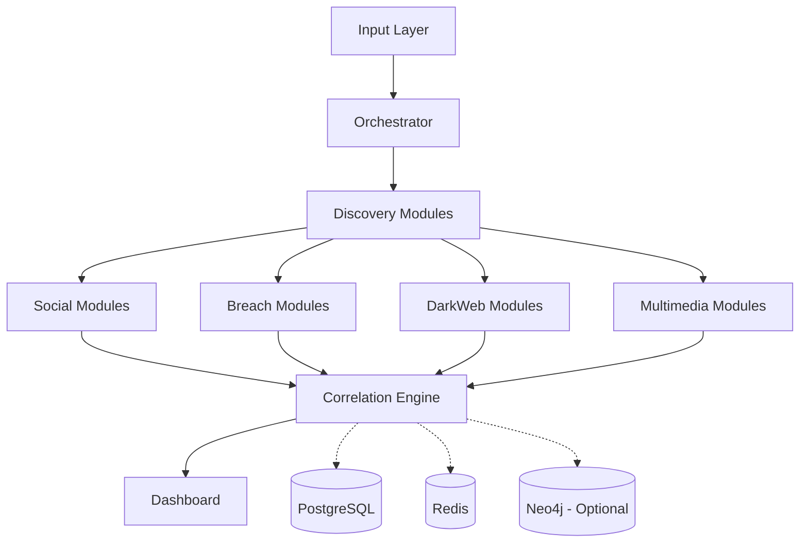

# Rahasya — Digital Footprint Intelligence Platform

## Overview
Rahasya is a recursive OSINT platform that accepts minimal input and discovers a maximum digital footprint. It automates intelligence gathering across social media, breach databases, and the dark web to build a comprehensive entity profile.

## Architecture


## Features
- Recursive discovery (BFS with depth/entity/time limits)
- 12+ OSINT modules (Maigret, Sherlock, WhatsMyName, HIBP, IntelX, LeakLookup, Ahmia, OnionSearch, EXIF, ImageHash, Archive.org)
- Entity resolution (fuzzy + deterministic)
- Interactive Kundli graph visualization (PyVis)
- Risk scoring and exposure analysis
- Dark web monitoring (via Tor)
- Celery + Redis task queue for async processing
- Production PostgreSQL storage

## Tech Stack
| Component | Technology | Purpose |
| --- | --- | --- |
| Core | Python 3.10+ | Primary logic and module execution |
| Web Dashboard | Streamlit | CIA-terminal themed user interface |
| Database | PostgreSQL | Persistent storage of entities and relationships |
| Task Queue | Celery + Redis | Asynchronous and distributed task execution |
| Graph DB | Neo4j (Optional) | Advanced relationship querying |
| Networking | Tor (Optional) | Dark web access for specific modules |

## Prerequisites
- Python 3.10+
- PostgreSQL 14+
- Redis 7+
- Tor (optional, for dark web)
- Node.js (optional, for Playwright)

## Installation
```bash
git clone https://github.com/yourusername/Rahasya.git
cd Rahasya
python -m venv .venv
.venv\Scripts\activate  # Windows
pip install -e .
cp .env.example .env
# Edit .env with your API keys and DB credentials
python -m rahasya init-db
```

## Quick Start
```bash
# Run a scan via CLI
python -m rahasya scan --name "John Doe" --email "john@example.com"

# Start the dashboard
python -m rahasya dashboard

# Start Celery worker (for async scans)
python -m rahasya worker
```

## Configuration
| Environment Variable | Description |
| --- | --- |
| `DATABASE_URL` | PostgreSQL connection string |
| `REDIS_URL` | Redis connection string for Celery |
| `HIBP_API_KEY` | HaveIBeenPwned API key (Optional) |
| `INTELX_API_KEY` | IntelligenceX API key (Optional) |
| `DEHASHED_API_KEY` | DeHashed API key (Optional) |
| `LEAKLOOKUP_API_KEY` | LeakLookup API key (Optional) |
| `NEO4J_URI` | Neo4j connection URI (Optional) |
| `NEO4J_USER` | Neo4j username (Optional) |
| `NEO4J_PASSWORD` | Neo4j password (Optional) |
| `TOR_SOCKS_PORT` | Tor SOCKS port (Optional) |
| `TOR_CONTROL_PORT` | Tor Control port (Optional) |
| `TOR_PASSWORD` | Tor password (Optional) |
| `MAX_RECURSION_DEPTH` | Maximum depth for recursive OSINT |
| `MAX_ENTITIES` | Maximum number of entities to discover |
| `MAX_SCAN_MINUTES` | Maximum scan duration |
| `LOG_LEVEL` | Application logging level |
| `ENVIRONMENT` | Environment type (development/production) |
| `DEBUG` | Debug mode toggle |

## Module Overview
| Module | Input | Output | Requires | Notes |
| --- | --- | --- | --- | --- |
| Social | Username, Name | Profiles, Aliases | - | Uses Maigret, Sherlock, WhatsMyName |
| Breach | Email, Domain | Passwords, Breaches | API Keys | Uses HIBP, IntelX, LeakLookup |
| DarkWeb | Email, Alias | Onion URLs | Tor | Uses Ahmia, OnionSearch |
| Multimedia | Images | EXIF Data, Hashes | - | Analyzes metadata and similarities |

## Dashboard
The Rahasya dashboard features a CIA-terminal themed interface providing actionable insights. Key pages include:
- **Scan Initialization**: Start targeted scans with minimal input.
- **Entity Resolution**: View and merge discovered entities.
- **Kundli Graph**: Interactive visual relationship mapping of digital footprints.
- **Risk Assessment**: Actionable risk scores based on breach and exposure data.

## Project Structure
```text
Rahasya/
├── rahasya/
│   ├── core/
│   ├── modules/
│   ├── db/
│   ├── cli/
│   └── dashboard/
├── tests/
├── .env.example
├── pyproject.toml
└── README.md
```

## License
MIT

## Disclaimer
This tool is for educational/ethical OSINT research only. Ensure you have authorization before scanning any targets.
