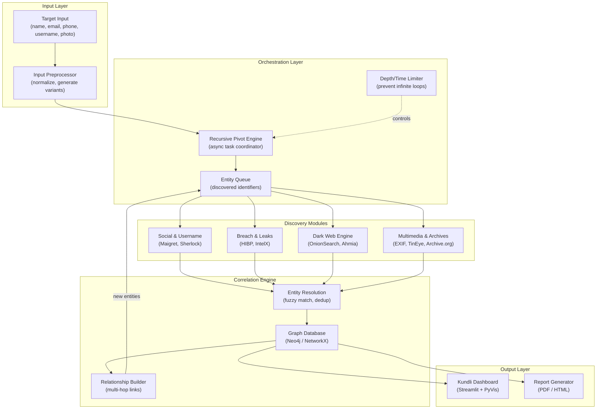

# Rahasya — OSINT Recursive Digital Footprint Intelligence Platform

## Overview

Build **Rahasya**, a modular Python platform that accepts minimal target input (name, email, phone, username, photo) and recursively discovers the maximum possible digital footprint by orchestrating free/open-source OSINT tools, correlating findings in a graph database, and presenting results in a cinematic "Kundli" dashboard.

---

## User Review Required

> [!IMPORTANT]
> **API Keys & Paid Tiers**: Several tools have shifted to paid models:
> - **Have I Been Pwned** — email/domain breach search requires a paid API key (~$4/month). The *Pwned Passwords* endpoint remains free.
> - **IntelX (Intelligence X)** — free tier is extremely limited (10 searches/day). Full access requires paid subscription.
> - **DeHashed** — no longer has a meaningful free tier; requires subscription.
> 
> **Decision needed**: Should we integrate these as optional modules that work *when API keys are provided*, or skip them entirely?

> [!WARNING]
> **Dark Web Engine**: Accessing `.onion` sites requires a running **Tor service** on the machine. On Windows, this means running the Tor Expert Bundle or Tor Browser. Many `.onion` search engines go offline frequently — the Dark Web module needs graceful fallback and dynamic endpoint configuration. This module will be functional only when Tor is running locally.

> [!CAUTION]
> **Ethical & Legal Boundaries**: This platform is designed for **academic/ethical OSINT research only**. No scraping of private data, no credential stuffing, no unauthorized access. The implementation will include ethical-use disclaimers and rate limiting throughout.

---

## Open Questions

1. **Database for Development**: Should we use **SQLite** during development (simpler, no setup) and optionally support PostgreSQL for production? Or require PostgreSQL from the start?

2. **Neo4j Deployment**: Should we require **Neo4j Desktop** (local install) or use **Neo4j Aura Free** (cloud, limited)? Alternatively, we could start with an **in-memory NetworkX graph** and add Neo4j as an optional backend.

3. **Task Queue Strategy**: For a college project, **Celery + Redis** is heavyweight infrastructure. Should we use a simpler approach — Python's `asyncio` + `concurrent.futures` — for the orchestrator, and add Celery support as an optional production mode?

4. **Photo Analysis**: Reverse image search tools (Google Lens, TinEye) have strict rate limits and anti-bot protections. Should we focus on **EXIF extraction + perceptual hashing** (local, reliable) and make reverse image search a manual/optional step?

5. **Scope of Phase 1**: Should we build all 8 modules in Phase 1, or focus on the core pipeline (Input → Social → Breach → Correlation → Dashboard) first?

---

## Proposed Architecture



---

## Technology Stack

| Component | Technology | Rationale |
|---|---|---|
| **Language** | Python 3.10+ | Required by Maigret; modern async support |
| **Orchestration** | `asyncio` + `concurrent.futures` (dev) / Celery + Redis (prod) | Lightweight for development; scales for production |
| **Graph DB** | NetworkX (dev) + Neo4j (optional prod) | Zero-setup dev experience; Neo4j for production-scale graphs |
| **Relational DB** | SQLite (dev) / PostgreSQL (prod) | SQLAlchemy ORM abstracts the backend |
| **Dashboard** | Streamlit + PyVis + streamlit-agraph | Rich interactive graph visualization |
| **Tor Integration** | `stem` + `requests[socks]` (PySocks) | Python Tor control + SOCKS5 proxy routing |
| **Entity Resolution** | RapidFuzz + custom rules | Fast fuzzy string matching |
| **Image Processing** | Pillow + OpenCV + imagehash | Face detection, EXIF, perceptual hashing |
| **Reporting** | Jinja2 + WeasyPrint | HTML template → PDF generation |

---

## Directory Structure

```
Rahasya/
├── rahasya/                        # Main package
│   ├── __init__.py
│   ├── __main__.py                 # CLI entry point
│   ├── config.py                   # Configuration & settings (Pydantic)
│   │
│   ├── core/                       # Core engine
│   │   ├── __init__.py
│   │   ├── orchestrator.py         # Recursive pivot engine
│   │   ├── entity_queue.py         # Entity discovery queue
│   │   ├── models.py               # Data models (Person, Email, Phone, etc.)
│   │   └── events.py               # Event system for module communication
│   │
│   ├── modules/                    # Discovery modules (plugin architecture)
│   │   ├── __init__.py
│   │   ├── base.py                 # Abstract base module class
│   │   ├── social/                 # Module 3: Social & Username
│   │   │   ├── __init__.py
│   │   │   ├── maigret_module.py
│   │   │   ├── sherlock_module.py
│   │   │   └── whatsmyname_module.py
│   │   ├── breach/                 # Module 4: Breach & Leak
│   │   │   ├── __init__.py
│   │   │   ├── hibp_module.py
│   │   │   ├── intelx_module.py
│   │   │   └── leaklookup_module.py
│   │   ├── darkweb/                # Module 5: Dark Web Engine
│   │   │   ├── __init__.py
│   │   │   ├── tor_manager.py
│   │   │   ├── onionsearch_module.py
│   │   │   └── ahmia_module.py
│   │   └── multimedia/             # Module 6: Multimedia & Archives
│   │       ├── __init__.py
│   │       ├── exif_module.py
│   │       ├── image_hash_module.py
│   │       └── archive_module.py
│   │
│   ├── correlation/                # Module 7: Correlation Engine
│   │   ├── __init__.py
│   │   ├── entity_resolver.py      # Fuzzy matching & dedup
│   │   ├── graph_manager.py        # Graph DB abstraction (NetworkX/Neo4j)
│   │   └── relationship_rules.py   # Rules for creating relationships
│   │
│   ├── storage/                    # Database layer
│   │   ├── __init__.py
│   │   ├── database.py             # SQLAlchemy session management
│   │   ├── sql_models.py           # SQL ORM models
│   │   └── migrations/             # Alembic migrations
│   │
│   ├── dashboard/                  # Module 8: Kundli Dashboard
│   │   ├── __init__.py
│   │   ├── app.py                  # Streamlit main app
│   │   ├── pages/
│   │   │   ├── 01_🔍_New_Scan.py
│   │   │   ├── 02_🕸️_Kundli_Graph.py
│   │   │   ├── 03_📊_Timeline.py
│   │   │   ├── 04_⚠️_Exposure_Report.py
│   │   │   └── 05_📄_Export.py
│   │   ├── components/             # Reusable Streamlit components
│   │   │   ├── graph_viewer.py
│   │   │   ├── entity_card.py
│   │   │   └── risk_meter.py
│   │   └── static/                 # CSS, images, fonts
│   │       └── style.css
│   │
│   └── utils/                      # Shared utilities
│       ├── __init__.py
│       ├── logging.py              # Structured logging (loguru)
│       ├── rate_limiter.py         # Global rate limiting
│       └── validators.py           # Input validation
│
├── tests/                          # Test suite
│   ├── __init__.py
│   ├── test_orchestrator.py
│   ├── test_modules/
│   │   ├── test_social.py
│   │   ├── test_breach.py
│   │   └── test_darkweb.py
│   └── test_correlation.py
│
├── data/                           # Local data storage
│   ├── reports/                    # Generated reports
│   └── cache/                      # Module result cache
│
├── docs/                           # Documentation
│   └── architecture.md
│
├── pyproject.toml                  # Project config & dependencies
├── requirements.txt                # Pip requirements (fallback)
├── .env.example                    # Environment variable template
├── .gitignore
├── README.md
└── LICENSE
```

---

## Detailed Module Specifications

### Module 1: Input & Preprocessing

#### [NEW] [config.py](file:///c:/KETAV/Nirma/4th%20Year/SMA/Rahasya/rahasya/config.py)
- Pydantic `Settings` class for all configuration
- API key management via `.env` file
- Depth limits, timeout settings, Tor proxy settings

#### [NEW] [models.py](file:///c:/KETAV/Nirma/4th%20Year/SMA/Rahasya/rahasya/core/models.py)
- Define entity types using Python dataclasses/Pydantic:
  - `TargetInput` — raw user input
  - `Person`, `Email`, `Phone`, `Username`, `SocialProfile`, `BreachRecord`, `DarkWebMention`, `Photo`
  - `EntityType` enum: `PERSON | EMAIL | PHONE | USERNAME | URL | PHOTO | IP_ADDRESS`
- Each entity has: `id`, `type`, `value`, `source`, `confidence`, `timestamp`, `metadata`

#### [NEW] [validators.py](file:///c:/KETAV/Nirma/4th%20Year/SMA/Rahasya/rahasya/utils/validators.py)
- Email format validation (regex + MX check)
- Phone normalization (phonenumbers library)
- Username variant generation (e.g., `john.doe` → `johndoe`, `john_doe`, `jdoe`)
- Photo preprocessing: face detection (OpenCV Haar cascades), EXIF extraction, pHash generation

---

### Module 2: Orchestrator & Recursive Pivot Engine

#### [NEW] [orchestrator.py](file:///c:/KETAV/Nirma/4th%20Year/SMA/Rahasya/rahasya/core/orchestrator.py)
Core brain of the system. Architecture inspired by SpiderFoot's publisher/subscriber model:

```python
class Orchestrator:
    """Recursive OSINT orchestration engine."""
    
    def __init__(self, config: Settings):
        self.config = config
        self.entity_queue = EntityQueue()      # Priority queue of entities to investigate
        self.visited = set()                    # Dedup: (entity_type, entity_value) tuples
        self.graph = GraphManager()             # Graph backend
        self.modules = ModuleRegistry()         # Registered discovery modules
        self.depth = 0
        self.max_depth = config.max_recursion_depth  # Default: 3
        self.max_entities = config.max_entities      # Default: 500
    
    async def run(self, target: TargetInput) -> ScanResult:
        """Main entry point. Seeds queue and starts recursive discovery."""
        # 1. Seed initial entities from target input
        # 2. While queue not empty AND within limits:
        #    a. Dequeue next entity
        #    b. Skip if visited
        #    c. Dispatch to relevant modules (parallel)
        #    d. Collect results → resolve entities → enqueue new discoveries
        #    e. Update graph
        # 3. Return final graph + report
```

**Anti-infinite-loop safeguards:**
- `visited` set prevents re-scanning the same `(type, value)` pair
- `max_depth` limits recursion hops (default: 3)
- `max_entities` caps total entities discovered (default: 500)
- `max_time` global timeout (default: 30 minutes)
- Confidence threshold: only pivot on entities with confidence ≥ 0.6

#### [NEW] [entity_queue.py](file:///c:/KETAV/Nirma/4th%20Year/SMA/Rahasya/rahasya/core/entity_queue.py)
- Priority queue backed by `heapq`
- Priority based on: entity confidence score × source reliability weight
- Thread-safe with `asyncio.Queue` for async operations

#### [NEW] [events.py](file:///c:/KETAV/Nirma/4th%20Year/SMA/Rahasya/rahasya/core/events.py)
- Simple pub/sub event system
- Events: `ENTITY_DISCOVERED`, `MODULE_COMPLETE`, `SCAN_PROGRESS`, `SCAN_COMPLETE`
- Dashboard subscribes to events for real-time progress updates

---

### Module 3: Social & Username Discovery

#### [NEW] [base.py](file:///c:/KETAV/Nirma/4th%20Year/SMA/Rahasya/rahasya/modules/base.py)
Abstract base class for all discovery modules:
```python
class BaseModule(ABC):
    name: str
    description: str
    accepts: list[EntityType]     # What entity types this module can process
    produces: list[EntityType]    # What entity types this module can discover
    
    @abstractmethod
    async def execute(self, entity: Entity) -> list[Entity]:
        """Run discovery on a single entity. Returns new entities found."""
    
    def is_available(self) -> bool:
        """Check if module dependencies are installed/configured."""
```

#### [NEW] [maigret_module.py](file:///c:/KETAV/Nirma/4th%20Year/SMA/Rahasya/rahasya/modules/social/maigret_module.py)
- **Primary username enumerator** — checks 3000+ sites
- Requires: `pip install maigret` (Python 3.10+)
- Integration: Import `maigret` package directly for programmatic use
- Input: `USERNAME` → Output: `SOCIAL_PROFILE`, `URL`, `EMAIL`
- Parse JSON output for structured profile data (bio, location, links)

#### [NEW] [sherlock_module.py](file:///c:/KETAV/Nirma/4th%20Year/SMA/Rahasya/rahasya/modules/social/sherlock_module.py)
- **Secondary username enumerator** — cross-validates Maigret findings
- Integration: `subprocess` call (Sherlock has no library API)
- Parse stdout for discovered URLs
- Input: `USERNAME` → Output: `URL`, `SOCIAL_PROFILE`

#### [NEW] [whatsmyname_module.py](file:///c:/KETAV/Nirma/4th%20Year/SMA/Rahasya/rahasya/modules/social/whatsmyname_module.py)
- Uses WhatsMyName JSON data for lightweight username checks
- Direct HTTP requests — no external tool dependency
- Input: `USERNAME` → Output: `URL`

---

### Module 4: Breach & Leak Discovery

#### [NEW] [hibp_module.py](file:///c:/KETAV/Nirma/4th%20Year/SMA/Rahasya/rahasya/modules/breach/hibp_module.py)
- **Have I Been Pwned** v3 API
- Requires API key (optional — module disabled without it)
- Rate limit: 1000 RPM on core plan
- Input: `EMAIL` → Output: `BREACH_RECORD` (breach name, date, data types)
- Free endpoint: password hash check (k-anonymity)

#### [NEW] [intelx_module.py](file:///c:/KETAV/Nirma/4th%20Year/SMA/Rahasya/rahasya/modules/breach/intelx_module.py)
- **Intelligence X** free API (10 searches/day limit)
- Searches across: pastes, leaks, darknet, WHOIS
- Input: `EMAIL | PHONE | USERNAME | URL` → Output: `LEAK_RECORD`, `URL`
- Graceful handling of rate limits

#### [NEW] [leaklookup_module.py](file:///c:/KETAV/Nirma/4th%20Year/SMA/Rahasya/rahasya/modules/breach/leaklookup_module.py)
- **Leak-Lookup** free API
- Input: `EMAIL | USERNAME` → Output: `BREACH_RECORD`

---

### Module 5: Dark Web Engine (Critical)

#### [NEW] [tor_manager.py](file:///c:/KETAV/Nirma/4th%20Year/SMA/Rahasya/rahasya/modules/darkweb/tor_manager.py)
- Manage Tor SOCKS5 proxy connection
- Uses `stem.control.Controller` to verify Tor is running
- Configure requests session with `socks5h://127.0.0.1:9050` (DNS over Tor)
- Circuit renewal for rate-limit evasion
- Health check: test connectivity to known `.onion` site

```python
class TorManager:
    def get_session(self) -> requests.Session:
        """Return a requests session routed through Tor."""
        session = requests.Session()
        session.proxies = {
            'http': 'socks5h://127.0.0.1:9050',
            'https': 'socks5h://127.0.0.1:9050'
        }
        return session
    
    def renew_circuit(self):
        """Request new Tor circuit for fresh exit node."""
        with Controller.from_port(port=9051) as ctrl:
            ctrl.authenticate()
            ctrl.signal(Signal.NEWNYM)
```

#### [NEW] [onionsearch_module.py](file:///c:/KETAV/Nirma/4th%20Year/SMA/Rahasya/rahasya/modules/darkweb/onionsearch_module.py)
- Custom implementation inspired by OnionSearch (original is unmaintained)
- Configurable list of `.onion` search engines (stored in `config/onion_engines.json`)
- Parallel search across: Ahmia, Haystak, Torch, DarkSearch
- Input: `EMAIL | USERNAME | PHONE | NAME` → Output: `DARK_WEB_MENTION`, `URL`

#### [NEW] [ahmia_module.py](file:///c:/KETAV/Nirma/4th%20Year/SMA/Rahasya/rahasya/modules/darkweb/ahmia_module.py)
- **Ahmia.fi** — clearnet API for searching `.onion` sites (no Tor required for API)
- REST API: `https://ahmia.fi/api/search/?q=<query>`
- Input: any entity → Output: `DARK_WEB_MENTION`, `URL`
- Fallback when Tor is not available

---

### Module 6: Multimedia & Historical Analysis

#### [NEW] [exif_module.py](file:///c:/KETAV/Nirma/4th%20Year/SMA/Rahasya/rahasya/modules/multimedia/exif_module.py)
- Extract EXIF metadata from photos (GPS, camera, timestamps)
- Libraries: Pillow + piexif
- Input: `PHOTO` → Output: `LOCATION`, `TIMESTAMP`, metadata dict

#### [NEW] [image_hash_module.py](file:///c:/KETAV/Nirma/4th%20Year/SMA/Rahasya/rahasya/modules/multimedia/image_hash_module.py)
- Perceptual hashing (pHash, dHash) for photo similarity matching
- Library: `imagehash`
- Compare target photo against discovered profile photos
- Input: `PHOTO` → Output: similarity scores, matched profiles

#### [NEW] [archive_module.py](file:///c:/KETAV/Nirma/4th%20Year/SMA/Rahasya/rahasya/modules/multimedia/archive_module.py)
- **Archive.org Wayback Machine** API integration
- Search for historical snapshots of discovered URLs
- Input: `URL` → Output: archived versions with timestamps

---

### Module 7: Correlation & Entity Resolution

#### [NEW] [graph_manager.py](file:///c:/KETAV/Nirma/4th%20Year/SMA/Rahasya/rahasya/correlation/graph_manager.py)
Dual-backend graph manager:

```python
class GraphManager:
    """Abstraction over NetworkX (dev) and Neo4j (prod)."""
    
    def add_entity(self, entity: Entity) -> str: ...
    def add_relationship(self, source_id, target_id, rel_type, metadata) -> None: ...
    def find_entity(self, entity_type, value) -> Optional[Entity]: ...
    def get_neighbors(self, entity_id, depth=1) -> list[Entity]: ...
    def get_subgraph(self, center_id, radius=2) -> Graph: ...
    def export_for_pyvis(self) -> dict: ...
```

**Neo4j Graph Schema:**
```
(:Person {name, dob, age_range, location})
(:Email {address, domain, provider})
(:Phone {number, country_code, carrier})
(:Username {handle, platform_count})
(:SocialProfile {url, platform, bio, followers, created_at})
(:BreachRecord {breach_name, date, data_types, severity})
(:DarkWebMention {source_url, context, discovered_at})
(:Photo {hash, exif_data, path})
(:Location {lat, lon, city, country})

Relationships:
(Person)-[:HAS_EMAIL]->(Email)
(Person)-[:HAS_PHONE]->(Phone)
(Person)-[:USES_USERNAME]->(Username)
(Username)-[:HAS_PROFILE]->(SocialProfile)
(Email)-[:APPEARED_IN]->(BreachRecord)
(Email|Username|Phone)-[:MENTIONED_ON]->(DarkWebMention)
(Person)-[:SAME_AS {confidence}]->(Person)  // entity resolution link
(Photo)-[:ASSOCIATED_WITH]->(SocialProfile)
(Photo)-[:TAKEN_AT]->(Location)
```

#### [NEW] [entity_resolver.py](file:///c:/KETAV/Nirma/4th%20Year/SMA/Rahasya/rahasya/correlation/entity_resolver.py)
- **Deterministic matching**: exact email/phone/username matches → auto-merge
- **Fuzzy matching**: name similarity (RapidFuzz, threshold ≥ 85%)
- **Photo matching**: perceptual hash distance ≤ 10 → likely same person
- **Cross-source linking**: if Email A found in Breach X and Username B found in Breach X → link Email A ↔ Username B

#### [NEW] [relationship_rules.py](file:///c:/KETAV/Nirma/4th%20Year/SMA/Rahasya/rahasya/correlation/relationship_rules.py)
- YAML-configurable rules for creating relationships
- Rules define: `IF condition THEN create_relationship(type, confidence)`
- Example: "If two usernames share the same email → SAME_PERSON (confidence: 0.9)"

---

### Module 8: Kundli Dashboard

The dashboard should feel like a **CIA-movie intelligence terminal** — dark theme, neon accents, real-time data feeds, interactive graph exploration.

#### [NEW] [app.py](file:///c:/KETAV/Nirma/4th%20Year/SMA/Rahasya/rahasya/dashboard/app.py)
- Streamlit main app with custom dark theme
- Multi-page navigation
- WebSocket-like updates via `st.empty()` + event polling

#### Dashboard Pages:

**Page 1: New Scan** (`01_🔍_New_Scan.py`)
- Input form: name, email, phone, username, photo upload
- Scan configuration: depth, timeout, module selection
- Live progress tracker with animated module status

**Page 2: Kundli Graph** (`02_🕸️_Kundli_Graph.py`)
- Full interactive graph visualization (PyVis)
- Color-coded nodes by entity type
- Edge thickness by confidence score
- Click-to-expand: click a node to see full details
- Filter panel: filter by entity type, source, confidence
- Physics simulation controls (spring strength, damping)

**Page 3: Timeline** (`03_📊_Timeline.py`)
- Chronological view of all discoveries
- Breach dates, profile creation dates, archive snapshots
- Plotly timeline chart

**Page 4: Exposure Report** (`04_⚠️_Exposure_Report.py`)
- Risk score calculation (0-100)
- Breakdown by category: social exposure, breach severity, dark web mentions
- Animated risk meter component
- Recommendations for reducing exposure

**Page 5: Export** (`05_📄_Export.py`)
- Generate PDF report (Jinja2 + WeasyPrint)
- Export graph as JSON/GraphML
- Export raw data as CSV

#### Dashboard Design System:
```css
/* Color palette */
--bg-primary: #0a0e17;       /* Deep space black */
--bg-secondary: #111827;     /* Dark slate */
--bg-card: #1a1f35;          /* Card background */
--accent-cyan: #00d4ff;      /* Primary accent */
--accent-purple: #8b5cf6;    /* Secondary accent */
--accent-green: #10b981;     /* Success / safe */
--accent-red: #ef4444;       /* Danger / breach */
--accent-amber: #f59e0b;     /* Warning */
--text-primary: #e2e8f0;     /* Primary text */
--text-muted: #64748b;       /* Muted text */

/* Glassmorphism cards */
.card {
    background: rgba(26, 31, 53, 0.7);
    backdrop-filter: blur(12px);
    border: 1px solid rgba(0, 212, 255, 0.15);
    border-radius: 12px;
}
```

---

## Proposed Changes — Phase-by-Phase

### Phase 1: Foundation (Core Pipeline)

Build the skeleton: input → orchestrator → 2 modules → graph → basic dashboard.

#### Core Package Setup
- [NEW] `pyproject.toml` — project metadata, dependencies, entry points
- [NEW] `requirements.txt` — fallback pip requirements
- [NEW] `.env.example` — API key template
- [NEW] `.gitignore` — Python, venv, data exclusions
- [NEW] `README.md` — project overview with setup instructions

#### Core Engine
- [NEW] `rahasya/config.py` — Pydantic Settings
- [NEW] `rahasya/core/models.py` — all entity data models
- [NEW] `rahasya/core/orchestrator.py` — recursive pivot engine
- [NEW] `rahasya/core/entity_queue.py` — priority queue
- [NEW] `rahasya/core/events.py` — pub/sub event system
- [NEW] `rahasya/utils/logging.py` — structured logging with loguru
- [NEW] `rahasya/utils/validators.py` — input validation & normalization
- [NEW] `rahasya/utils/rate_limiter.py` — token bucket rate limiter

#### Storage Layer
- [NEW] `rahasya/storage/database.py` — SQLAlchemy async session
- [NEW] `rahasya/storage/sql_models.py` — SQL ORM models (Scan, Entity, Finding)

#### First Discovery Modules
- [NEW] `rahasya/modules/base.py` — abstract base module
- [NEW] `rahasya/modules/social/maigret_module.py` — Maigret integration
- [NEW] `rahasya/modules/social/sherlock_module.py` — Sherlock integration

#### Correlation (Basic)
- [NEW] `rahasya/correlation/graph_manager.py` — NetworkX backend
- [NEW] `rahasya/correlation/entity_resolver.py` — deterministic matching

#### Dashboard (Skeleton)
- [NEW] `rahasya/dashboard/app.py` — Streamlit app shell
- [NEW] `rahasya/dashboard/pages/01_🔍_New_Scan.py`
- [NEW] `rahasya/dashboard/pages/02_🕸️_Kundli_Graph.py`
- [NEW] `rahasya/dashboard/static/style.css` — dark theme CSS

---

### Phase 2: Discovery Modules Expansion

#### Breach & Leak Modules
- [NEW] `rahasya/modules/breach/hibp_module.py`
- [NEW] `rahasya/modules/breach/intelx_module.py`
- [NEW] `rahasya/modules/breach/leaklookup_module.py`

#### Dark Web Engine
- [NEW] `rahasya/modules/darkweb/tor_manager.py`
- [NEW] `rahasya/modules/darkweb/onionsearch_module.py`
- [NEW] `rahasya/modules/darkweb/ahmia_module.py`
- [NEW] `data/config/onion_engines.json` — configurable .onion search engine list

#### Multimedia
- [NEW] `rahasya/modules/multimedia/exif_module.py`
- [NEW] `rahasya/modules/multimedia/image_hash_module.py`
- [NEW] `rahasya/modules/multimedia/archive_module.py`

#### Additional Social
- [NEW] `rahasya/modules/social/whatsmyname_module.py`

---

### Phase 3: Correlation Engine Enhancement

#### Advanced Entity Resolution
- [MODIFY] `entity_resolver.py` — add fuzzy matching, photo matching
- [NEW] `rahasya/correlation/relationship_rules.py` — YAML rule engine
- [NEW] `data/config/relationship_rules.yaml` — default rule definitions
- [MODIFY] `graph_manager.py` — add Neo4j backend support

---

### Phase 4: Dashboard & Reporting Polish

#### Dashboard Pages
- [NEW] `rahasya/dashboard/pages/03_📊_Timeline.py`
- [NEW] `rahasya/dashboard/pages/04_⚠️_Exposure_Report.py`
- [NEW] `rahasya/dashboard/pages/05_📄_Export.py`

#### Dashboard Components
- [NEW] `rahasya/dashboard/components/graph_viewer.py` — PyVis wrapper
- [NEW] `rahasya/dashboard/components/entity_card.py` — entity detail cards
- [NEW] `rahasya/dashboard/components/risk_meter.py` — animated risk gauge

#### Reporting
- [NEW] `rahasya/dashboard/templates/report.html` — Jinja2 report template
- [NEW] report generation logic in Export page

---

## Key Dependencies

```toml
[project]
name = "rahasya"
version = "0.1.0"
requires-python = ">=3.10"

dependencies = [
    # Core
    "pydantic>=2.0",
    "pydantic-settings>=2.0",
    "loguru>=0.7",
    "python-dotenv>=1.0",
    "aiohttp>=3.9",
    "httpx>=0.27",
    
    # OSINT Tools
    "maigret>=0.4",
    "sherlock-project>=0.15",
    
    # Database
    "sqlalchemy[asyncio]>=2.0",
    "aiosqlite>=0.20",       # SQLite async driver
    "alembic>=1.13",
    
    # Graph
    "networkx>=3.2",
    "neo4j>=5.0",            # Optional
    
    # Correlation
    "rapidfuzz>=3.6",
    "phonenumbers>=8.13",
    
    # Image Processing
    "Pillow>=10.0",
    "imagehash>=4.3",
    "opencv-python-headless>=4.9",
    
    # Tor / Dark Web
    "stem>=1.8",
    "requests[socks]>=2.31",   # PySocks
    
    # Dashboard
    "streamlit>=1.32",
    "pyvis>=0.3",
    "streamlit-agraph>=0.0.45",
    "plotly>=5.18",
    
    # Reporting
    "Jinja2>=3.1",
    "weasyprint>=62",
    
    # Utilities
    "rich>=13.7",              # Rich console output for CLI
    "click>=8.1",              # CLI framework
]
```

---

## Verification Plan

### Automated Tests
```bash
# Unit tests for each module
pytest tests/ -v

# Test orchestrator with mock modules
pytest tests/test_orchestrator.py -v

# Test entity resolution
pytest tests/test_correlation.py -v
```

### Manual Verification
1. **Phase 1**: Run a scan with a known public figure's username → verify Maigret/Sherlock find social profiles → verify graph is populated → verify dashboard displays results
2. **Phase 2**: Test breach module with a known breached email (from HIBP) → verify breach records appear in graph. Test Ahmia API with a benign query.
3. **Phase 3**: Run full pipeline with multiple inputs → verify entity resolution correctly merges related entities → verify graph relationships are accurate
4. **Phase 4**: Verify dashboard aesthetics match the "CIA terminal" design spec. Generate PDF report and verify formatting.

### Integration Test
```bash
# Full end-to-end scan (use a test/dummy identity)
python -m rahasya scan --name "Test User" --email "test@example.com" --username "testuser123"

# Launch dashboard
streamlit run rahasya/dashboard/app.py
```
